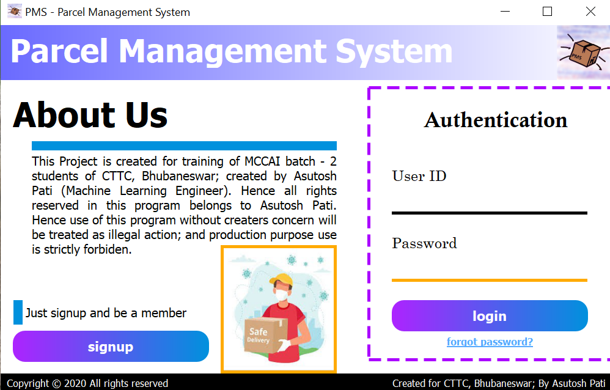
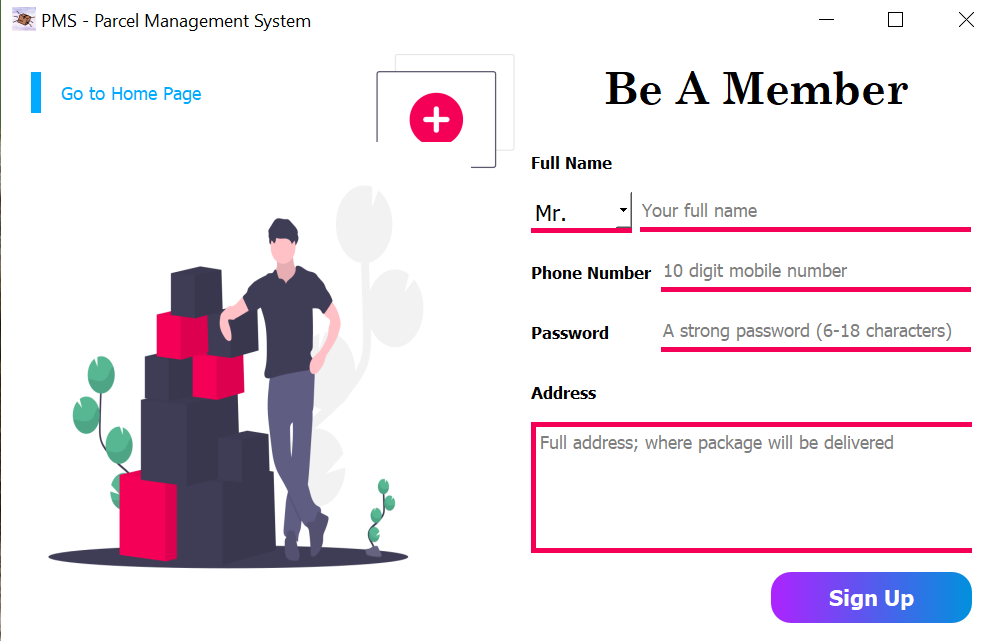
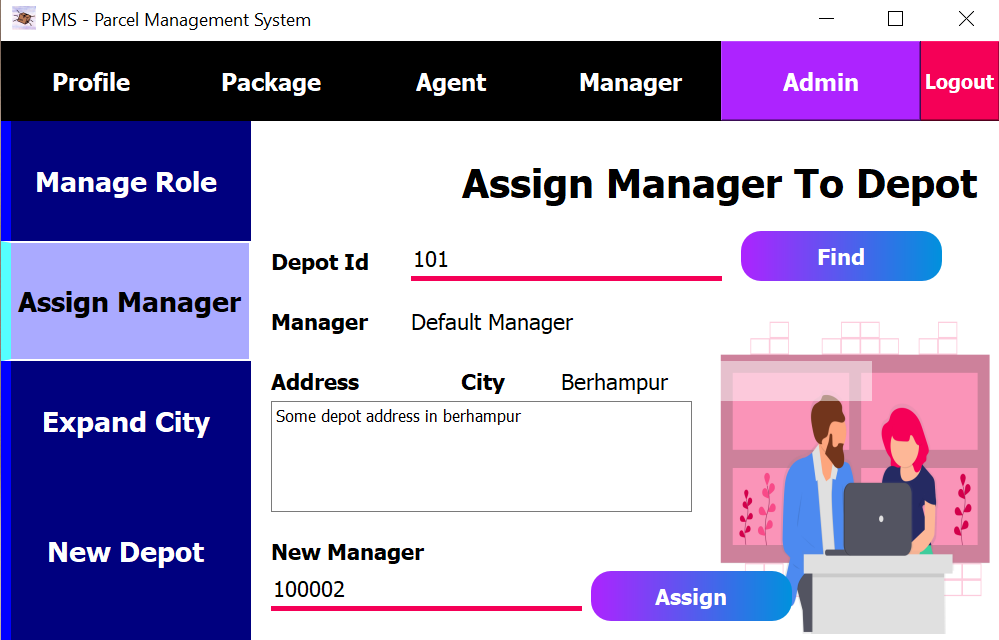
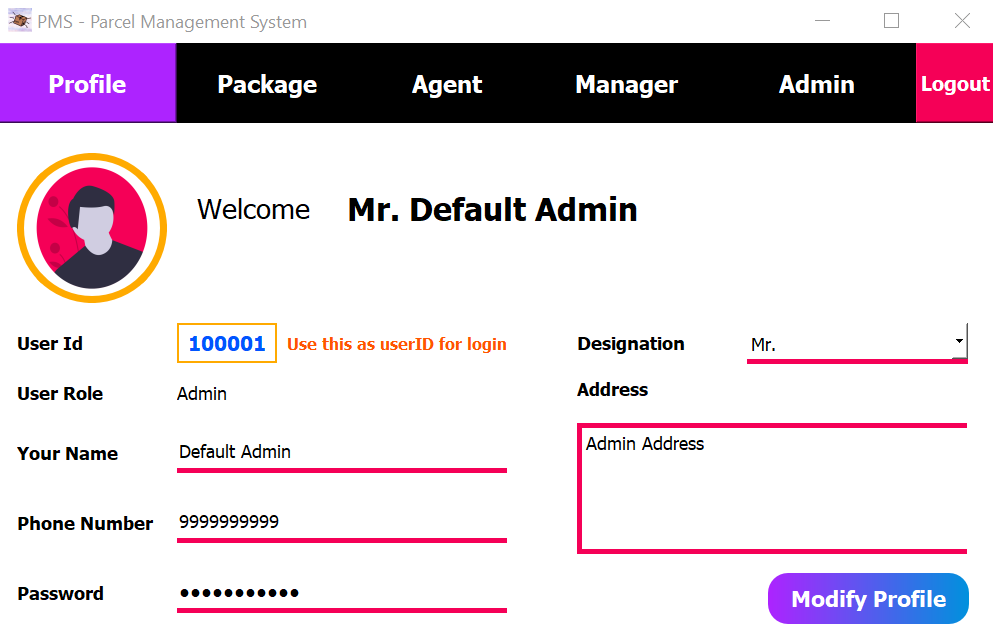
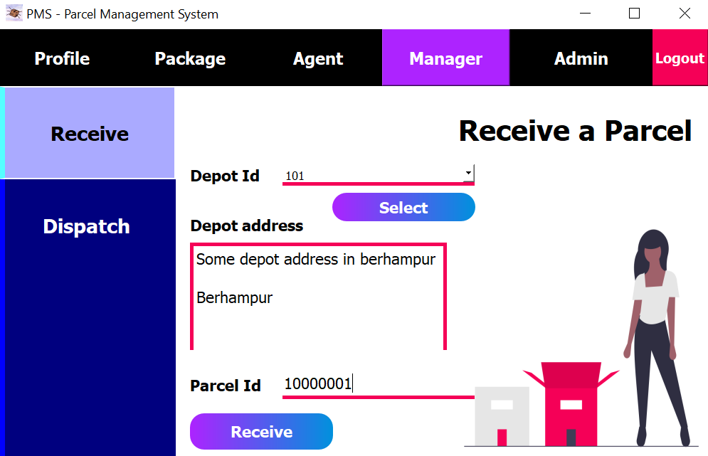
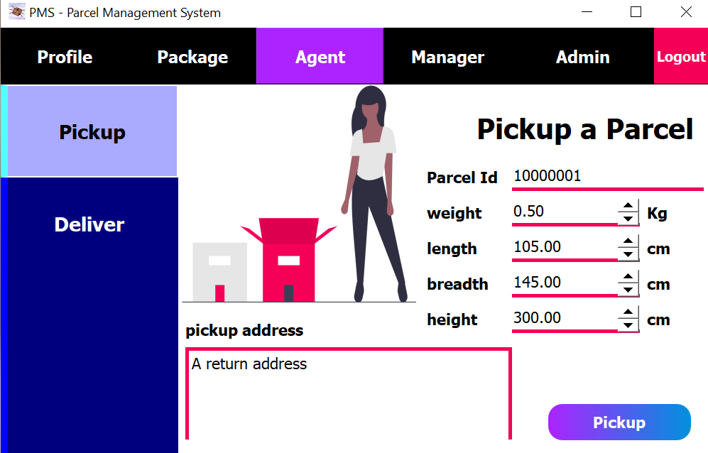
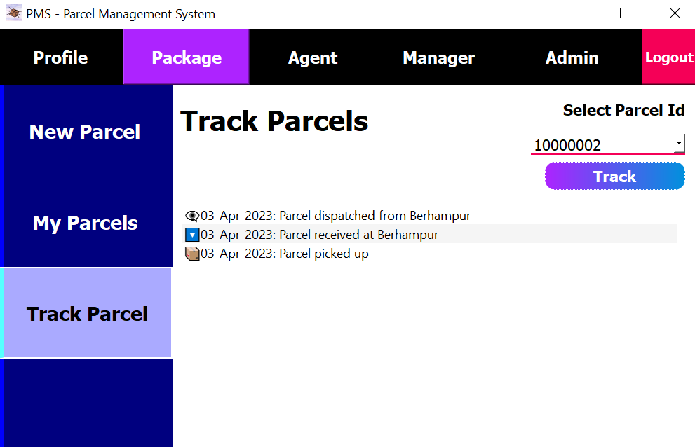
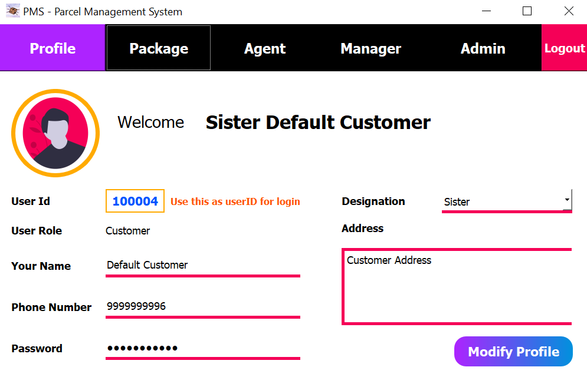

# Parcel Management System
**Author**: Asutosh Pati<br>
**Purpose**: For training of MCCAI - batch 2 of CTTC, Bhuabneswar<br>
**Date of Creation**: 21 Nov. 2020<br>
**Last Updated**: 04 Apr. 2023

### About this project
<div style="text-align: justify">
A parcel management system is a software application designed to help businesses manage their parcel delivery operations
efficiently. This project simulates a real life example of Parcel Management system which will help the students to 
understand about the python and GUI integration with the data base. The system can track and manage parcels from the 
time they are picked up until they are delivered to their final destination. This dummy project may involve developing 
a user-friendly interface for parcel management, creating a database to store parcel information, and providing 
real-time tracking updates to customers. The system can benefit businesses of all sizes, including e-commerce stores, 
courier services, and supply chain companies, by improving operational efficiency, reducing errors, and enhancing 
customer satisfaction.

In this project we have 4 types of users (Admin, Agent, Customer, Manager), so that students can understand how diffrent
roles work in programming environment; As this project provides certain functionalities that differ with the roles.
Every user can have access to their own profile data which can be modified by the user itself. Every user can order a 
parcel and can track the ordered parcel. Where as an agent can pickup a pracel and can deliver to an user. An Manager is
the incharge of a depot and can manage the shipment of parcel in depot of their supervision. An admin has access of 
creating a new depot, manage user privileges like appointing managers, angents and new admins along with this admin has 
full accesss over the database. With all this functionality the students can also learn about the versioning and the 
modification works that can be done during development of any project is required.

**You can use this source code for educational purposes untill and unless you provide the credits to the author. Also 
give a star anf follow me if you like the project.**
</div>

### Screenshots

  |  |
:-------------------------:|:-------------------------: |
  |  |
  |  |
  |  |

### How to use
This project is build over python & PyQt; and tested on python 3.9.13 with the below dependencies. Don't forget to 
install them before running the code.
```
pip install PyQt5==5.15.7
pip install PyQtWebEngine==5.15.4
```
Don't want to install python or any other packages, simply move to ```dist``` directory and 
[download](https://github.com/AsutoshPati/Parcel-Management-System/tree/main/dist) ```PMS-one-file.exe``` or 
```PMS-one-dir.zip``` extract and run the application.

<br>

#### Default Users
The below users will be created during the first run and further this users can be used to start using the program.

| User ID | User Name        | Mobile     | Password    |
|---------|------------------|------------|-------------|
| 100001  | Default Admin    | 9999999999 | Default@123 |
| 100002  | Default Manager  | 9999999999 | Default@123 |
| 100003  | Default Agent    | 9999999999 | Default@123 |
| 100004  | Default Customer | 9999999999 | Default@123 |

<br>

#### Features
| Features                   | Admin  | Manager | Agent | Customer |
|----------------------------|--------|---------|-------|----------|
| Signup                     | ❌️| ❌️| ❌️| ✔️|
| Login                      | ✔️| ✔️| ✔️| ✔️|
| Forgot Password            | ✔️| ✔️| ✔️| ✔️|
| Update Profile             | ✔️| ✔️| ✔️| ✔️|
| Order Parcel               | ✔️| ✔️| ✔️| ✔️|
| Check Parcel Details       | ✔️| ✔️| ✔️| ✔️|
| Track Parcel               | ✔️| ✔️| ✔️| ✔️|
| Pickup Parcel              | ❌️| ❌️| ✔️| ❌️|
| Deliver Parcel             | ❌️| ❌️| ✔️| ❌️|
| Receive Parcel at Depot    | ❌️| ✔️| ❌️| ❌️|
| Dispatch Parcel from Depot | ❌️| ✔️| ❌️| ❌️|
| Manage Roles               | ✔️| ❌️| ❌️| ❌️|
| Assign Manager to Depot    | ✔️| ❌️| ❌️| ❌️|
| Exapan to New City         | ✔️| ❌️| ❌️| ❌️|
| Establish New Depot        | ✔️| ❌️| ❌️| ❌️|

<br>

#### Getting Started
- Let's start by creating a new customer; Provide a name, select a appropriate title, provide an unique mobile number 
along with a strong password which should contain atleast 6 characters and at max 18 with a upper case, lower case and 
a digit, also don't forget to add a address.
- You can also use the existing customer ```User ID: 100004; Password: Default@123``` for the following steps.
- Once user is created successfully; it will automatically take you the dashboard.
- **Now remember your user ID**; you will need it for next login.
  - Incase you forgot your user ID; you can check it directly from the database in ```UserDetail``` table.
- Now if you want; you can logout from the dashboard and try logging in again. Other wise continue with next steps.
  - If you have logged out and don't remember the password you can try with ```forgot password``` option. Otherwise 
login to continue with the next steps.
- Now let's try to modify some profile details; change the details you want to update (remember user ID can't be 
modified at any time in the dashboard). Once you are done with changes just save it by clicking on ```modify profile```
button. On success you will receive a confirmation message.
- Now let's try to order a parcel; Go to ```Package``` ➡️ ```Order Parcel```. Select a payment type (as this is a 
dummy project platform will not ask you for any payment details) then select a product category as per you choice and 
place the order. On success you will receive a confirmation message along with the parcel ID.
- At this moment we have ordered a parcel, but for next steps we need to explore some functionalities of manager & agent
roles. So you can logout from the customer dashboard. [Update User Role](#change-user-role)
- Let's login as **Agent**. An agent can pickup or deliver parcels. You can try with the default agent 
(```User ID: 100003; Password: Default@123```) or you can create a new one that we will cover later in this section.
- Let's try to pick up a parcel. Go to ```Agent``` ➡️ ```Pickup```. Now you can pickup a parcel by providing parcel ID
(If you don't remember the parcel ID created at earlier stage then don't worry you can try with ```10000001```; or if 
you haven't ordered any parcel yet then order a parcel first then try with this step again), weight, height, length and
width of the parcel, also a return address is mandatory to provide. Once you have all the information you good to go. 
Just click on the ```Pickup``` button to continue. You will receive a confirmation message on success.
- Now you can logout from agent dashboard and login as ```Customer``` to check the parcel details.
  - Go to ```Package``` ➡️ ```My Parcels``` select a parcel ID you want to check details and continue.
  - You can also track the parcel now. Go to ```Package``` ➡️ ```Track Parcel``` select the parcel ID you want to 
  track and continue.
- Now let's logout and explore some functionalities of ```Admin```. An admin can expand to new city, create a new depot,
manage roles of user and assign manager to depots. Intially you have login with the default admin (```User ID: 100001; 
Password: Default@123```) provided during the intialization of the app.
- Let's add a new city now; go to ```Admin``` ➡️ ```Expand City```. Provide a new city name and click on ```Expand```
to contine. On success you will receive a confiramtion message. 
  - **Remember only unique cities are allowed to create.**
- Now we are all set a create a depot. Go to ```Admin``` ➡️ ```New Depot```.
  - Provide the city ID (you can try with ```101``` if you have created city in the previous step, otherwise create a 
  city first to continue) and click on ```find``` to search for the city name; if you forgot city ID don't worry you can 
  check it in ```Admin ➡ Expand City``` page.
  - Once you get the city name where you want to create depot; just provide a depot address and a manager ID (you can 
  use the default manager ```User ID: 100002``` or you can provide any other manager ID if you have creted, which we 
  will see in a later stage in this section [Update User Role](#change-user-role)) to create a depot.
- [Optional Step] Now let's see how you can update manager of a depot. Go to ```Admin``` ➡️ ```Assign Manager```.
  - Provide the depot ID (try with ```101``` if you have created depot at the prvious step; otherwise you can try with
  other depot IDs when you create them) and manager ID (try with ```100002``` or you can use other manager IDs when you 
  create them) and click on ```Assign``` to assign manager to the depot.
- <span id="change-user-role" style="color: #FFCC00;">**[Optional Step] Now let's see how you can update user roles**. Go to 
```Admin``` ➡️ ```Manage Role```.</div>
  - Provide an user ID and click of on ```Find User```. If any user is available with that ID you can update the role
  by selecting the desired role and clicking on the ```Assign``` button.
- Now let's explore some functionalities of ```Manager```. A manager can receive or dispatch parcel from the depot 
he/she is assigned to. Login as a manager; you can use the default manager ```User ID: 100002; Passwor: Default@123``` 
or you can use any other manager credential if you have created them. [Update User Role](#change-user-role)
- Go to ```Manager``` ➡️ ```Receive```. Select the depot ID and provide the parcel ID (you can try with 
```10000001``` if you have already ordered parcel; otherwise try with ordering a parcel) and click on ```Receive``` 
button to receive the parcel at depot.
- There is similar process available to dispatch the parcel from the depot in ```Admin``` ➡️ ```Dispatch```.
- You can login with the customer dashboard to track the parcel after the above process; and you will find the parcel 
status over there.
- At last you can deliver or return a parcel by an agent; which you can find at ```Agent``` ➡️ ```Deliver```. Just
provide the parcel ID check the details and choose what to do, whether to deliver or to return.
- After completing the above process. Login as customer and track the parcel to see the updated status.

### License
[GNU General Public License V3.0](https://www.gnu.org/licenses/gpl-3.0.en.html)
